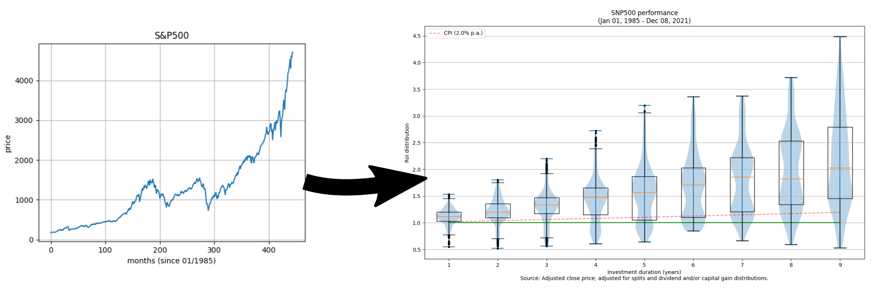
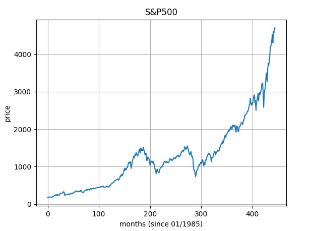
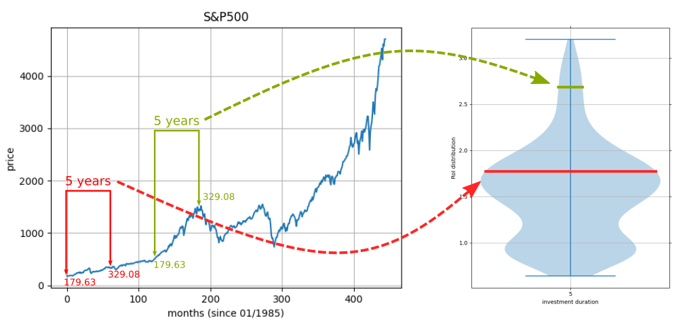

# Stock-Dis
## Distribution of performance for investments done over a fixed period of time.
---
These are plots that show a distribution of every possible investment over a fixed period of time.


### What?
We have all seen these kind of plots:



What if we are interested in making an investment of 5 years in an S&P500 ETF?
We can look at the performance of every possible time interval of 5 years in the S&P500.
Even though historical data is not an indication of future performance, these statistics can give a solid indication of what to expect.



This script generates distribution for fixed time intervals. Following the five-year example, we can compute the RoI for all possible 5 year windows and show it as a violin plot (see above).

This distribution shows a perspective that is useful for long-time investment, and shows
what the ROI has been for every investment (purchase and sell) that has lasted exactly `Y` years.

### Usage
Download the script and call it using `python3`:

```
usage: stock-dis.py [-h] [-i FILE] [-y YEARS] [-p PERCENTAGE] [-s] [-l] [-d POINTS] [-R]

optional arguments:
  -h, --help            show this help message and exit
  -i FILE, --input FILE
                        Input file (TXT) from Yahoo Finance
  -y YEARS, --num_years YEARS
                        Up to how many years shall distributions be plotted.
  -p PERCENTAGE, --cpi PERCENTAGE
                        Average consumer price index (single value). For germany has been 2.1, for the EU is 3.94 and for the world is 5.55
  -s, --silent          Supress interactive plot
  -l, --logy            Plot Y-axis in log-scale
  -d POINTS, --drop_points POINTS
                        Ignore the first POINTS points (in months).
  -R, --recovery        For time intervals that underperform wrt CPI, plot distribution of "time until they recover".
```
### Input data
For convenience, the script uses the same tabular data that is available from the historical values used by Yahoo Finance. It consists of 6 columns, separated by TABs. The format is:
```
Month Day, Year [TAB] Open [TAB] High [TAB] Low Close* [TAB] Adj Close** [TAB] Volume [NEWLINE]
```
Data is assumed to be sorted chronologically, with the most recent values first.
Each entry should correspond to one month's time.

### License
MIT (see `LICENSE`).